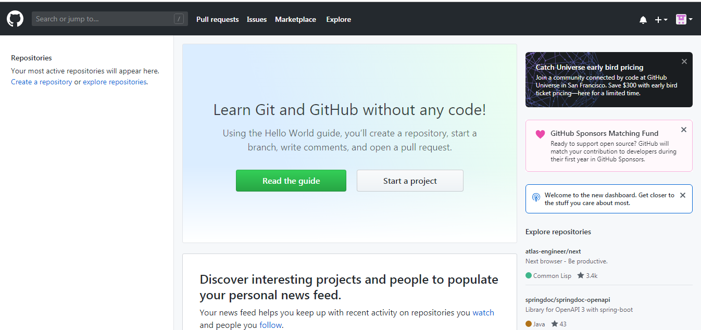
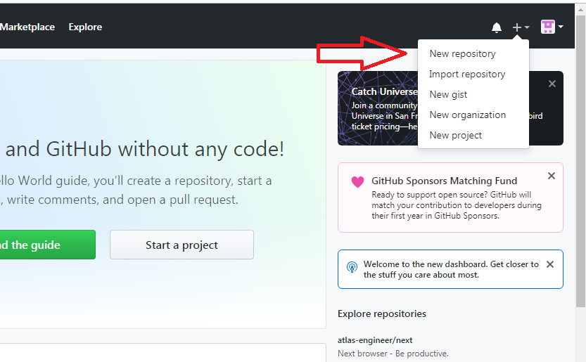
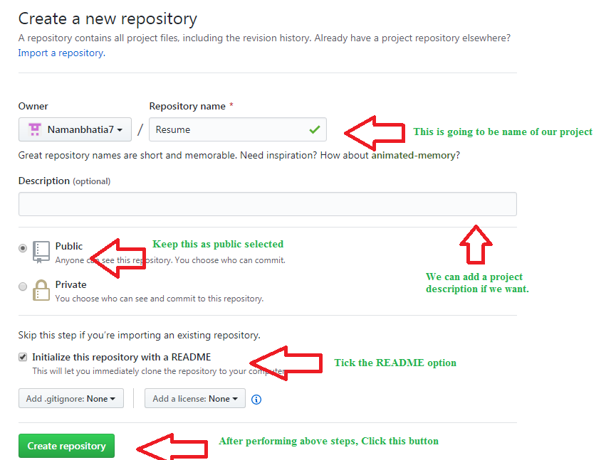
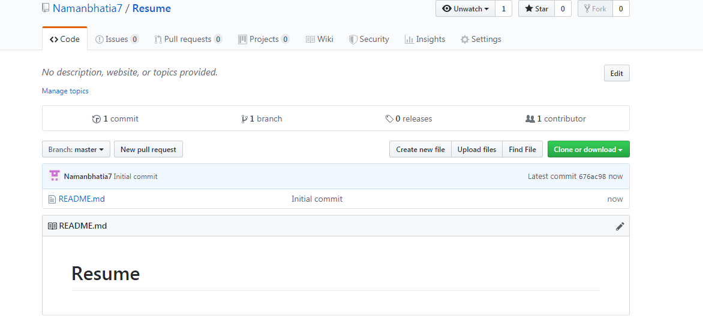
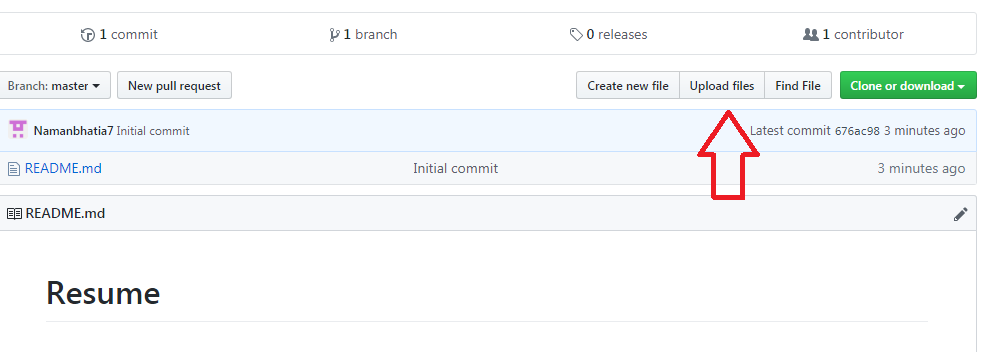
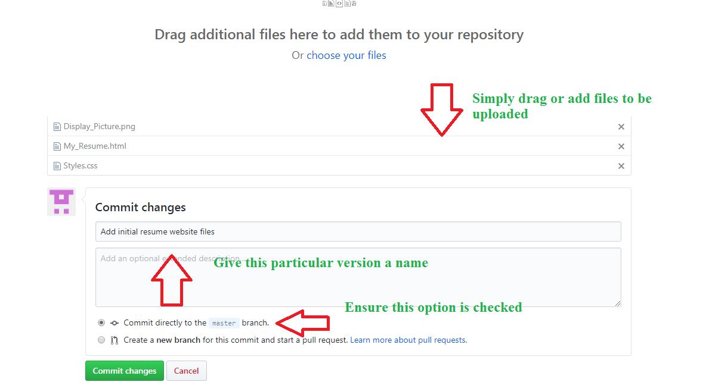
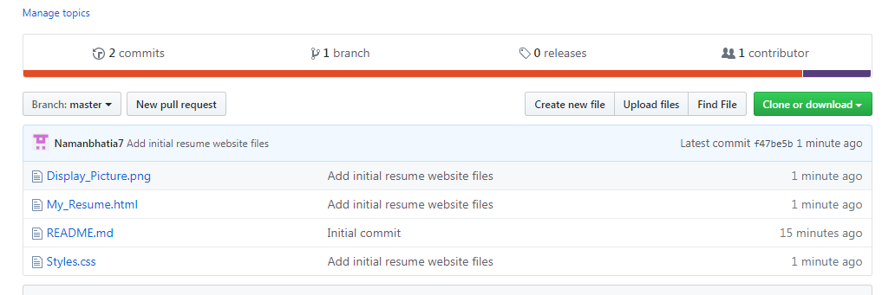

[](https://classroom.github.com/a/8wgCKhpZ)
[](https://classroom.github.com/online_ide?assignment_repo_id=18344217&assignment_repo_type=AssignmentRepo)
# se-day-2-git-and-github
## Explain the fundamental concepts of version control and why GitHub is a popular tool for managing versions of code. How does version control help in maintaining project integrity?  
**Fundamental Concepts**  
- Enables multiple people to simultaneously work on single project
- Integrates work done simultaneously by different team members. 
- Gives access to historical versions of your project  

**Why is GitHub popular?** --> GitHub is a popular source code management (SCM) platform used by developers to manage their project files. It offers collaborative features that make it easy for team members to share and modify projects, as well as automatic versioning so developers can track changes and revert back to previous versions if needed. Additionally, GitHub provides a variety of other tools that help developers be more productive, such as issue tracking, file sharing, and collaboration tools.  
**How version control helps in maintaining project integrity**  
VCS act as safety net for project integrity by providing comprehensive history of changes made to files, documents, or code over time. This means that if errors occur or unintended changes are made, previous versions can be easily accessed and restored

## Describe the process of setting up a new repository on GitHub. What are the key steps involved, and what are some of the important decisions you need to make during this process?
**Steps to Create the Repository**
Step 1: After successfully setting up GitHub account login to your account. You will see the screen as below.  
  
Step 2: Click on the new repository option.  
  
Step 3: After clicking new repository option, we will have to initialize some things like, naming our project, choosing the visibility etc. After performing these steps click Create Repository button.  
  
Step 4: After clicking the button, we will be directed to below page. Right now the only file we have is a readme file.  
  
Step 5: Now click on the “Upload files” button.  
  
Step 6: Follow the steps mentioned in the Picture below and click “commit changes”  
  
step 7: Now you will see that all of our files uploaded in our github  


**Decision to make**
- Collaboration strategy e.g., branching
- Project structure e.g., .gitignore, folder organization
- License Type e.g., Apache, MIT
- Repository Visibility e.g., public or private

# Commits the tracked changes and prepares them to be pushed to a remote repository. To remove this commit and modify the file, use 'git reset --soft HEAD~1' and commit and add the file again.

```sh
git commit -m "Your commit message"
```
This command commits all tracked changes, meaning files that have already been added to Git with git add. The commit is now saved in your local repository, but it hasn't been pushed to a remote repository yet.
**Undoing last commit**

```sh
git reset --soft HEAD~1
```  

After this, you can modify the files, add them again using git add, and commit with a new message.

## Discuss the importance of the README file in a GitHub repository. What should be included in a well-written README, and how does it contribute to effective collaboration?
**Importance of README file**  
A README file is a crucial component of any GitHub repository as it serves as the primary documentation for a project. It provides an overview of the project, instructions on how to use it, and guidelines for contributors. A well-written README improves the usability, accessibility, and collaboration within a repository.

**What Should Be Included in a Well-Written README**
A comprehensive README should include the following sections:

Project Title & Description  
A clear and concise title with a short description of the project.  

Installation Instructions  
Steps to install and set up the project, including dependencies.

Usage Guide  
Examples of how to use the project, including code snippets if applicable.

Contributing Guidelines  
Information on how others can contribute, including code style, pull requests, and issue tracking.

License  
Specifies the open-source license under which the project is distributed.

Contact & Support  
How users can get in touch for support or questions.

Acknowledgments & Credits  
Recognizing contributors, libraries, or external resources used.

**How It Contributes to Effective Collaboration**  
- Sets Expectations: Clearly defines how the project should be used and contributed to.
- Reduces Redundancy: Answers frequently asked questions, minimizing the need for repeated explanations.
- Facilitates Onboarding: Helps new developers get started without extensive guidance.
- Encourages Community Involvement: A detailed README attracts contributors by making the project more approachable.

## Compare and contrast the differences between a public repository and a private repository on GitHub. What are the advantages and disadvantages of each, particularly in the context of collaborative projects?
#### Public Repositories  
A public repository is visible to anyone on GitHub, meaning anyone can view, clone, and fork the repository. However, only authorized collaborators can push changes.

**Advantages**     
- Open Collaboration: Encourages contributions from developers worldwide, fostering innovation and knowledge sharing.
- Community Engagement: Attracts users, testers, and contributors, which is useful for open-source projects.
- Visibility & Portfolio Building: Developers can showcase their work, helping with career opportunities.
- Free Hosting: Public repositories on GitHub are free with unlimited collaborators.

**Disadvantages**  
- Security Risks: Code and data are exposed to the public, increasing risks of unauthorized use or malicious activity.
- Lack of Privacy: Proprietary or sensitive information cannot be stored safely.
- Unwanted Contributions: Open collaboration can lead to spam or low-quality pull requests.

**Best Use Cases**  
- Open-source projects
- Academic and research collaborations
- Personal portfolios and project showcases
- Publicly shared tools and libraries

#### Private Repositories  
A private repository restricts access to specific users, meaning only invited collaborators can view, clone, or contribute to the code.

**Advantages**
- Confidentiality: Ideal for proprietary projects, protecting intellectual property.
- Controlled Access: Only authorized users can view or modify the code, enhancing security.
- Security & Compliance: Suitable for projects requiring compliance with regulations (e.g., GDPR, HIPAA).

**Disadvantages**
- Limited Community Contributions: Private repositories do not attract external contributors.
- Paid Plans for Teams: While individuals can create private repositories for free, organizations may require paid GitHub plans for advanced collaboration features.
- Reduced Visibility: Work remains hidden, which may limit networking and career opportunities.

**Best Use Cases**
- Proprietary or commercial projects
- Internal business applications
- Sensitive research projects
- Early-stage development before public release

## Detail the steps involved in making your first commit to a GitHub repository. What are commits, and how do they help in tracking changes and managing different versions of your project?
**Steps to make first commit to a Github Repository**  
1. Create a GitHub Repository  
- Log in to GitHub.  
- Click the + sign in the top-right corner and select New repository.
- Enter a repository name and description.
- Choose public or private visibility.
(Optional) Initialize with a README file.
- Click Create repository.

2. Set Up Git Locally  
Ensure Git is installed:

```sh
git --version
```

If not installed, download it from git-scm.com.    
Set up your user information (only needed once):

```sh
git config --global user.name "Your Name"  
git config --global user.email "your.email@example.com"
```

3. Clone the Repository (If Created on GitHub)  
If you created the repository on GitHub, clone it locally:

```sh
git clone https://github.com/your-username/repository-name.git  
cd repository-name
```

Alternatively, initialize a new repository locally:

```sh
mkdir my-project  
cd my-project  
git init  
```

4. Add a New File (Optional)  
Create a file, e.g., index.html or README.md:

```sh 
echo "# My First Project" > README.md
```

5. Stage the Changes  
Git doesn’t track new files until you add them. Use:

```sh
git add README.md
```

To stage all changes:

```sh
git add .
```

6. Commit the Changes  
Create your first commit with a message describing the changes:

```sh
git commit -m "Initial commit"
```

7. Connect to GitHub Repository (If Created Locally)  
If you initialized the repository locally, link it to GitHub:

```sh
git remote add origin https://github.com/your-username/repository-name.git  
git branch -M main
```

8. Push the Commit to GitHub  
Upload the commit to GitHub:

```sh
git push -u origin main
```

9. Verify on GitHub  
Go to your GitHub repository.   
Refresh the page, and you’ll see your committed files  

## How does branching work in Git, and why is it an important feature for collaborative development on GitHub? Discuss the process of creating, using, and merging branches in a typical workflow.  
**What is a Branch in Git**  
A branch in Git is an independent line of development that allows multiple developers to work on different features or fixes simultaneously without affecting the main project.

The default branch in most repositories is called main (or master in older versions). Developers create new branches to experiment, develop features, or fix bugs, and later merge them back into the main branch.

Why is Branching Important?
- Isolates Changes: Allows development of new features without affecting the main codebase.
- Facilitates Collaboration: Multiple team members can work on different features simultaneously.
- Supports Code Review & Testing: Changes can be tested before merging into the main branch.
- Enhances Workflow Flexibility: Enables working on hotfixes, experimental features, and stable releases efficiently.

Typical Branching Workflow
1. Creating a New Branch  
To create and switch to a new branch:  

```sh
git checkout -b feature-branch
```

Alternatively, create a branch without switching:

```sh
git branch feature-branch
```

To list all branches:

```sh
git branch
```

2. Switching Between Branches  
To switch back to the main branch:  

```sh
git checkout main  
```

Or use:   

```sh
git switch main  
```

3. Making Changes & Committing to the Branch  
Modify files and stage them:  

```sh
git add .
```

Commit the changes:  

```sh
git commit -m "Added new feature"  
```

4. Pushing the Branch to GitHub  
To push the branch to GitHub:  

```sh
git push -u origin feature-branch
```

This makes the branch available for others to collaborate on.

5. Creating a Pull Request (PR) on GitHub
- Navigate to the repository on GitHub.
- Click "Compare & pull request" next to the new branch.
- Add a description of the changes.
- Request reviews from team members.
- Click "Create pull request".

6. Reviewing & Merging the Branch
Code Review: Team members review the code and suggest changes.
Merging: If everything looks good, merge the branch into main:  

```sh
git checkout main  
git merge feature-branch  
```

Or on GitHub, click "Merge pull request".
Deleting the Branch (Optional): After merging, delete the branch:  

```sh
git branch -d feature-branch  
git push origin --delete feature-branch
```

## Explore the role of pull requests in the GitHub workflow. How do they facilitate code review and collaboration, and what are the typical steps involved in creating and merging a pull request?
**Typical Steps Involved in Creating and Merging a Pull Request**  
1. Create a New Branch
Before creating a PR, developers typically create a new branch where they will make their changes. This keeps the main branch clean and ensures that changes are isolated.  

```sh
git checkout -b feature-branch
```

2. Make Changes and Commit
Make the necessary changes to your code, then stage and commit them to your branch. 

```sh
git add .  
git commit -m "Added new feature or fixed a bug"
```
3. Push the Branch to GitHub
Once the changes are committed, push the branch to GitHub to share it with collaborators.  

```sh
git push origin feature-branch
```

4. Create a Pull Request
On GitHub, go to your repository and click on the "Compare & pull request" button for the branch you pushed. This will open the PR interface.

- Title & Description: Provide a clear title and detailed description of the changes you made.
- Base Branch: Select the branch you want to merge your changes into (typically `main`).
- Compare Branch: Select the branch containing your changes (e.g., `feature-branch`).
- Assign Reviewers: Choose team members to review the code.
- Click Create pull request.

5. Code Review Process
Once the PR is created, collaborators can:

- Leave comments, suggestions, and questions.
- Request changes if the code does not meet the project standards.
- Approve the PR if everything looks good.
  
6. Make Updates (if necessary)
If reviewers suggest changes or find issues, you can make the changes on the same branch and push the updates. The PR will automatically update with the new commits.  

```sh
git commit -m "Addressed review comments"
git push origin feature-branch
```
7. Merge the Pull Request
Once the PR is approved and all issues are resolved:

- Merge into the Base Branch: If you're a collaborator with write access, you can click the "Merge pull request" button. This integrates your changes into the main branch.
- Squash and Merge: This option combines all the commits into one, keeping the commit history clean.
- Rebase and Merge: This option preserves the commit history but rewrites the base of your changes, making it appear as if they were created from the latest commit on the main branch.  
  
8. Delete the Branch (Optional)
After merging, it’s common practice to delete the branch to keep the repository clean.  

```sh
git branch -d feature-branch
git push origin --delete feature-branch
```

9. Sync Local Repository
After the PR is merged, sync your local repository with the remote repository to stay up-to-date.

```sh
git checkout main
git pull origin main
```

**Why Pull Requests are Essential in Collaborative Development**
- Code Quality & Consistency: Ensures that multiple developers can contribute without introducing errors or inconsistencies into the codebase.
- Transparency & Accountability: PRs provide a clear record of what changes were made and why, making it easier to track contributions.
- Controlled Merges: The review process allows teams to ensure only stable and well-tested code is merged into the main branch.

## Discuss the concept of "forking" a repository on GitHub. How does forking differ from cloning, and what are some scenarios where forking would be particularly useful?
**What is Forking in Github**  
Forking a repository in GitHub creates a personal copy of someone else’s repository under your GitHub account. It allows you to experiment, modify, and contribute to the project without affecting the original repository.

A forked repository retains a connection to the original (upstream) repository, enabling you to sync changes from the original source and submit pull requests if you want to contribute back

**How forking differ from cloning**

| Feature          | **Forking** | **Cloning** |
|----------------|------------|------------|
| **Definition**  | Creates a copy of a repository under your **GitHub account**. | Creates a **local copy** of a repository on your computer. |
| **Where It Lives** | The forked repository is stored on **GitHub** under your account. | The cloned repository exists **only on your local machine**. |
| **Ownership**  | You own the forked repo and can modify it freely. | You do **not** own the cloned repository; it remains connected to the original repo. |
| **Connection to Original Repo** | Forks remain separate from the original, but you can sync updates from the upstream repository. | Cloning keeps a direct connection to the original repository if you have write access. |
| **Purpose**  | Used for contributing to open-source projects, independent development, or preserving abandoned projects. | Used for local development and testing. |
| **Can Submit Pull Requests?** | Yes, you can submit a **pull request (PR)** to the original repository. | No, unless you have **write access** to the original repository. |
| **Can Push Changes?** | Yes, but only to the forked repository under your account. | No, unless you have permission to push to the original repo. |

**When is Forking Useful**

Contributing to Open-Source Projects  
Fork a public repository to make modifications.
Push changes to your fork.
Submit a pull request (PR) to merge changes into the original repository.

Personal Customization  
Fork an open-source project to modify it for personal use without affecting the main project.

Experimentation & Learning  
Test new features or modifications in a separate copy of a project without breaking the original repository.

Preserving an Abandoned Project  
If a public repository is no longer maintained, forking allows you to continue development under your own account.

## Examine the importance of issues and project boards on GitHub. How can they be used to track bugs, manage tasks, and improve project organization? Provide examples of how these tools can enhance collaborative efforts.

**The Importance of Issues and Project Boards on GitHub**  
1. GitHub Issues: Tracking Bugs & Feature Requests
GitHub Issues act as a built-in ticketing system to track bugs, feature requests, and other development tasks. They help teams organize work, discuss improvements, and collaborate effectively.

How Issues Help in Project Management:
Bug Tracking → Developers report and discuss bugs in a structured way.
Feature Requests → Users or contributors suggest improvements or new features.
Task Assignment → Issues can be assigned to specific team members.
Discussion & Collaboration → Contributors can discuss possible solutions using comments.  

2. GitHub Project Boards: Organizing Workflows
GitHub Project Boards provide a Kanban-style view to track issues, tasks, and progress. They help teams visualize their workflow and streamline project management.

How Project Boards Enhance Organization:
- Task Categorization → Organize tasks into columns (e.g., To Do, In Progress, Done).
- Issue Integration → Link issues directly to tasks for easy tracking.
- Automations → Move tasks automatically based on their status.
- Collaboration → Assign team members to tasks and track progress.

How Issues and Project Boards Improve Collaboration
- Clear Task Ownership → Every issue/task is assigned to the right developer.
- Transparency → Everyone on the team knows what’s being worked on.
- Better Prioritization → Urgent issues can be marked with labels like high-priority.
- Efficient Workflow → Teams can automate task movement from In Progress to Done.
- Cross-Team Coordination → Developers, testers, and designers can collaborate seamlessly.

## Reflect on common challenges and best practices associated with using GitHub for version control. What are some common pitfalls new users might encounter, and what strategies can be employed to overcome them and ensure smooth collaboration?

1. Merge Conflicts
Problem:

When multiple developers modify the same file, Git cannot automatically merge the changes, causing a conflict.

Solution:

Use feature branches instead of working directly on main.
Regularly pull updates from the repository (git pull origin main).
Resolve conflicts using a merge tool or manually in the code editor.

2. Committing Large, Unstructured Changes
Problem:

Making large, disorganized commits makes debugging and reviewing difficult.

Solution:

Follow the "small and frequent commits" rule.
Use descriptive commit messages, e.g., `git commit -m "Fix login button alignment issue"`.
Use `git diff` to review changes before committing

3. Accidental Pushes to `main` (or `master`)
Problem:

Pushing changes directly to the main branch without review can break the project.

Solution:

Use branch protection rules to prevent direct pushes to `main`.
Work on feature branches (`git checkout -b feature-new-ui`).
Use pull requests (PRs) for review before merging.

4. Forgetting to Pull Before Pushing  
Problem:

If a teammate has pushed updates, pushing without pulling can create unnecessary conflicts.

Solution:

Always run `git pull origin main` before pushing changes.
Use `git fetch` to check for remote changes without merging immediately.

5. Poorly Managed Pull Requests (PRs)  
Problem:

PRs without proper descriptions or too large to review efficiently.

Solution:

Keep PRs small and focused on one task.
Use clear PR titles and descriptions with context.
Request code reviews and use GitHub Discussions to clarify any doubts.

6. Pushing Sensitive Data (API Keys, Passwords, etc.)
Problem:

Accidentally committing `.env` files, API keys, or passwords exposes them publicly.

Solution:

Use a `.gitignore` file to prevent committing sensitive files.
If credentials are exposed, immediately revoke them and generate new ones.

7. Lack of Documentation and Readability
Problem:

Team members struggle to understand project structure or workflows.

Solution:

Maintain a README.md with project setup, usage, and contribution guidelines.
Use issue templates and project boards for clear task tracking.

**Best Practices for Smooth Collaboration**  
- Use Feature Branches → Keep `main` stable and use branches for new features (`git checkout -b feature-branch`).
- Write Meaningful Commit Messages → Clearly describe what each commit does (`git commit -m "Refactored authentication logic"`).
- Pull Before You Push → Prevent conflicts by always pulling the latest changes (`git pull origin main`).
- Use Pull Requests & Code Reviews → Encourage collaboration and maintain code quality before merging.
- Keep Your Repository Organized → Use labels, milestones, and project boards to structure your work.
- Protect Sensitive Data → Use `.gitignore` and environment variables to prevent exposing credentials.
- Automate Testing & CI/CD → Integrate GitHub Actions to automatically test code before merging.